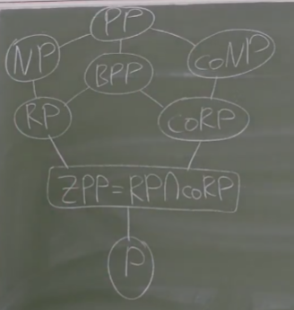

---

# 1. Асимптотические обозначения: $O, o, \Theta, \Omega, \omega$

$(\le) f(n) = O(g(n))$, если $\exists C > 0, \exists N, \forall n > N: f(n) < C \cdot g(n)$  
$(\ge) f(n) = \Omega(g(n))$, если $\exists c > 0, \exists N, \forall n > N: f(n) > c \cdot g(n)$  
$(=) f(n) = \Theta(g(n))$, если $\exists c > 0, \exists C > 0, \exists N, \forall n > N: c \cdot g(n) < f(n) < C \cdot g(n)$  
$(<) f(n) = o(g(n))$, если $\forall c > 0, \exists N, \forall n > N: f(n) < c \cdot g(n)$  
$(>) f(n) = \omega(g(n))$, если $\forall C > 0, \exists N, \forall n > N: f(n) > C \cdot g(n)$  

---

# 2. Многоленточная машина Тьюринга, вычисления на ней, измерение времени и памяти

**Детерминированная МТ с $k$ лентами**  
кортеж $\langle \Sigma, \Gamma, Q, q_1, q_a, q_r, k, \delta \rangle$, где:
  - $k$ - количество лент, бесконечных в обе стороны
  - $\Sigma$ - входной алфавит
  - $\Gamma$ - ленточный алфавит (включает пустой символ $\#$)
  - $Q$ - конечное множество состояний, $q_1$ - начальное, $q_a$ - принимающее, $q_r$ - отвергающее
  - $\delta$ - функция перехода ($\delta : (Q \setminus \{q_a, q_r\}) \times \Gamma^k \to Q \times \Gamma^k \times \{L, R, N\}^k$)

**Вычисление**  
Последовательность конфигураций. Конфигурация МТ - кортеж $(q, w_1, p_1, \dots, w_k, p_k)$, где $q \in Q$ - текущее состояние, $w_i \in \Gamma^*$ - содержимое $i$-й ленты до последнего непустого символа, $p_i \in \mathbb{N}$ - позиция каретки на $i$-й ленте. В начале на первой ленте написано слово, остальные пусты, состояние $q_1$. Машина делает шаги по функции $\delta$. Слово принимается, если машина приходит в состояние $q_a$, и отвергается, если в $q_r$

**Измерение времени**  
Время работы $T(n)$ - сложность в худшем случае (см. определение в пункте $4$)

**Измерение памяти**  
Память $S(n)$ - это максимальное количество ячеек на рабочих лентах (всех, кроме входной, она **только для чтения**), на которые машина указывала хоть раз

---

# 3. Недетерминированная машина Тьюринга

**Определение**  
Это такая же МТ, но ее функция перехода $\delta$ многозначна. Находясь в одной конфигурации, машина может перейти в несколько возможных следующих состояний:

$$\delta : (Q \setminus \{q_a, q_r\}) \times \Gamma^k \to 2^{Q \times \Gamma^k \times \{L, R, N\}^k}$$ 

**Условие принятия**  
НМТ принимает слово, если существует хотя бы одна ветвь приводит в принимающее состояние $q_a$

---

# 4. Временные сложностные классы: $\mathbf{P}, \mathbf{E}, \mathbf{EXP}$ 

**Язык**  
$A \subset \{0, 1 \}^*$

**$\boxed{\mathbf{time_M}(x)}$**

Число шагов машины $M$ для решения задачи $A$ $(x \in A \iff M(x) = 1)$

**$\boxed{\mathbf{time_M}(n)}$ (Сложность в худшем случае)**

$\max_{|x| = n} \mathbf{time_M}(x)$  

**$\boxed{\mathbf{space_M}(x)}$**

Число ячеек рабочих лент, используемых машиной $M$ для решения задачи на входе $x$

**$\boxed{\mathbf{space_M}(n)}$ (Емкостная сложность в худшем случае)**

$\max_{|x| = n} \mathbf{space_M}(x)$  

**$\boxed{\mathbf{DTIME}\ (T(n))}$**

$\{A \mid \exists M \text{ - ДМТ}, M \text{ решает } A, \mathbf{time_M}(n) = O(T(n)) \}$

**$\boxed{\mathbf{P}}$**

$\bigcup_{c=1}^\infty \mathbf{DTIME}(n^c)$

- Например, `проверить наличие Эйлерова цикла` (связность + четность степеней)

**$\boxed{\mathbf{QP}}$**

$\bigcup_{c=1}^\infty \mathbf{DTIME}(2^{\log^c n})$

**$\boxed{\mathbf{E}}$**

$\bigcup_{c=1}^\infty \mathbf{DTIME}(2^{cn})$

**$\boxed{\mathbf{EXP}}$**

$\bigcup_{c=1}^\infty \mathbf{DTIME}(2^{n^c})$

---

# 5. Классы $\mathbf{NP}$ и $\mathbf{coNP}$. Определения через сертификаты и через НМТ

**$\boxed{\mathbf{NTIME}}$**

$\{A \mid \exists M \text{ - НМТ}, M \text{ решает } A, \mathbf{time_M}(n) = O(T(n))\}$

**$\boxed{\mathbf{NP}}$**

$\bigcup_{c=1}^\infty \mathbf{NTIME}(n^c)$

**$\boxed{\mathbf{NP} \ \text{(Через сертификаты)}}$**

$A \in \mathbf{NP} \iff \exists \text{ полином } p \text{ и poly-вычислимый верификатор } V: x \in A \iff \exists s, |s| \le p(|x|): V(x, s) = 1$

- Например, `проверить выполнимость булевой формулы`

**$\boxed{\mathbf{NEXP}}$**

$\bigcup_{c=1}^\infty \mathbf{NTIME}(2^{n^c})$

**$\boxed{\mathbf{coNP}}$**

$A \in \mathbf{coNP} \iff \overline{A} \in \mathbf{NP}$

- Например, `проверить тавтологичность булевой формулы`

**$\boxed{\mathbf{coNP} \ \text{(Через сертификаты)}}$**

$A \in \mathbf{coNP} \iff \exists \text{ полином } p \text{ и poly-вычислимый верификатор } V: x \in A \iff \forall s, |s| \le p(|x|): V(x, s) = 1$

---

# 6. Полиномиальная сводимость по Карпу

**Полиномиально вычислимая функция**  
Такая $f: \{0,1\}^* \to \{0,1\}^*$, что $\exists$ ДМТ останавливается за полиномиальное от $|x|$ время

**Полиномиальная сводимость по Карпу**  
$A \le_p B$, если существует полиномиально вычислимая $f: \{0, 1\}^* \to \{0, 1\}^*$, что:
$$x \in A \iff f(x) \in B$$

---

# 7. $\mathbf{NP}$-трудность и $\mathbf{NP}$-полнота

**$\boxed{\mathbf{NPH}}$ (NP-трудные)**

$B \in \mathbf{NPH} \iff \forall A \in \mathbf{NP}: A \le_p B$

**$\boxed{\mathbf{NPC}}$ (NP-полные)**

$B \in \mathbf{NPC} \iff B \in \mathbf{NP}, B \in \mathbf{NPH}$

**Свойства сводимости:**

- **Транзитивность:**  
  $A \le_p B, B \le_p C \implies A \le_p C$
- **Замкнутость для $\mathbf{P}$ и $\mathbf{NP}$:**  
  $A \le_p B, B \in \mathbf{P} \implies A \in \mathbf{P}$  
  $A \le_p B, B \in \mathbf{NP} \implies A \in \mathbf{NP}$  
- **Сводимость дополнений:**  
  $A \le_p B \iff \overline{A} \le_p \overline{B}$
- **Передача $\mathbf{NPH}$:**  
  $B \in \mathbf{NPH}, B \le_p C \implies \forall A \in \mathbf{NP}: A \le_p B \le_p C \implies C \in \mathbf{NPH}$
- **Свойство $\mathbf{NPC}$:**  
  $B \in \mathbf{NPC}, B \le_p C, C \in \mathbf{NP} \implies C \in \mathbf{NPC}$

---

# 8. Уровни полиномиальной иерархии

**$\boxed{\mathbf{DP}}$**

$\{A \cap B \mid A \in \mathbf{NP}, B \in \mathbf{coNP}\}$

**$\boxed{\mathbf{\Sigma_k^p}}$**

$\{A \mid \exists \text{ полином } p \text{ и poly-вычислимый верификатор } V: x \in A \iff \exists y_1 \forall y_2 \exists y_3 \dots y_k: \forall i: |y_i| \le p(|x|)$ и $V(x, y_1, y_2, \dots, y_k) = 1 \}$

**$\boxed{\mathbf{\Pi_k^p}}$**

$\{A \mid \exists \text{ полином } p \text{ и poly-вычислимый верификатор } V: x \in A \iff \forall y_1 \exists y_2 \forall y_3 \dots y_k: \forall i: |y_i| \le p(|x|)$ и $V(x, y_1, y_2, \dots, y_k) = 1 \}$

**Начало иерархии:**  
- $\mathbf{\Sigma_0^p} = \mathbf{\Pi_0^p} = \mathbf{P}$  
- $\mathbf{\Sigma_1^p} = \mathbf{NP}$  
- $\mathbf{\Pi_1^p} = \mathbf{coNP}$  
- $\forall k \ge 0$:
  - $\mathbf{\Sigma_k^p} \subset \mathbf{\Sigma_{k+1}^p}$
  - $\mathbf{\Pi_k^p} \subset \mathbf{\Pi_{k+1}^p}$
  - $\mathbf{\Sigma_k^p} \subset \mathbf{\Pi_{k+1}^p}$
  - $\mathbf{\Pi_k^p} \subset \mathbf{\Sigma_{k+1}^p}$

*Все доказывается через фиктивную переменную, см. утверждения*

**$\boxed{\mathbf{PH}}$**

$\bigcup_{k=0}^\infty \mathbf{\Sigma_k^p} = \bigcup_{k=0}^\infty \mathbf{\Pi_k^p}$

**Коллапс иерархии:**  
Если $\mathbf{P} = \mathbf{NP}$, то $\mathbf{P} = \mathbf{coNP} \implies$ последний квантор можно убирать, и как итог $\mathbf{P} = \mathbf{PH}$

**Полнота в полиномиальной иерархии:**  
- Язык $B$ является $\mathbf{\Sigma_k^p}$-полным, если $B \in \mathbf{\Sigma_k^p}$ и $\forall A \in \mathbf{\Sigma_k^p}: A \le_p B$
- Язык $B$ является $\mathbf{\Pi_k^p}$-полным, если $B \in \mathbf{\Pi_k^p}$ и $\forall A \in \mathbf{\Pi_k^p}: A \le_p B$
- Язык $B$ называется $\mathbf{PH}$-полным, если $B \in \mathbf{PH}$ и $\forall A \in \mathbf{PH}: A \le_p B$

*Последний существует только в случае коллапса иерархии*

**Альтернирующая МТ**  
МТ, в которой состояниия разбиты на $2$ типа: $\mathbf{\Sigma}$ и $\mathbf{\Pi}$  
- в $\mathbf{\Sigma}$-состоянии узел принимается, по условию $\lor$
- в $\mathbf{\Pi}$-состоянии узел принимается, по условию $\land$
- Старт в $\Sigma$-состоянии

*НМТ - частный случай АМТ, когда все состояния $\mathbf{\Sigma}$*

**Альтернирование**  
Смена типа состояния с $\mathbf{\Sigma}$ на $\mathbf{\Pi}$ или обратно на одной ветви вычислительного дерева. Число альтернирований - максимальное число таких смен по всем ветвям

**$\boxed{\mathbf{\Sigma_k\,TIME}\ (T(n))}$**

$\{A \mid \exists M \text{ - АМТ}, M \text{ решает } A, \mathbf{time_M}(n) = O(T(n)), \text{ число альтернирований } \le k\}$

**$\boxed{\mathbf{\Pi_k\,TIME}\ (T(n))}$**

Аналогично, но старт в $\mathbf{\Pi}$-состоянии

**$\boxed{\mathbf{\Sigma_k^p} \ \text{(через альтернирование)}}$**

$\bigcup_{c=1}^\infty \mathbf{\Sigma_k\,TIME}(n^c)$

**$\boxed{\mathbf{\Pi_k^p} \ \text{(через альтернирование)}}$**

$\bigcup_{c=1}^\infty \mathbf{\Pi_k\,TIME}(n^c)$

**$\boxed{\mathbf{AP}}$**

$\{A \mid \exists M \text{ - АМТ}, M \text{ решает } A, \mathbf{time_M}(n) = O(\text{poly}(n)), \text{ нет ограничения на число альтенирований} \}$

> $$\mathbf{AP} = \mathbf{PSPACE}$$

---

# 9. Классы $\mathbf{PSPACE}$, $\mathbf{L}$, $\mathbf{NL}$

Рассматриваем МТ на $2$ лентах (напоминание: основная лента - $\text{read-only}$, и не учитывается в подсчете рабочей памяти)

**$\boxed{\mathbf{DSPACE}\ (S(n))}$**  
$\{A \mid \exists M \text{ - ДМТ с read-only входом, решает } A, \mathbf{space_M}(n) = O(S(n))\}$

**$\boxed{\mathbf{NSPACE}\ (S(n))}$**  
$\{A \mid \exists M \text{ - НМТ с read-only входом, решает } A, \mathbf{space_M}(n) = O(S(n))\}$

**$\boxed{\mathbf{L}}$**  
$\mathbf{DSPACE}(\log n)$

**$\boxed{\mathbf{NL}}$**  
$\mathbf{NSPACE}(\log n)$

**$\boxed{\mathbf{NL} \text{ (через сертификаты)}}$**  
$A \in \mathbf{NL} \iff \exists$ полиномиально ограниченный сертификат $s$ и детерминированный верификатор $V$, работающий на логарифмической памяти, что:
$$x \in A \iff \exists s: V(x, s) = 1$$
Причем верификатор читает сертификат только слева направо, возвращаться назад нельзя

**$\boxed{\mathbf{polyL}}$**  
$\mathbf{DSPACE}(\text{poly}(\log n))$

**$\boxed{\mathbf{PSPACE}}$**  
$\mathbf{DSPACE}(\text{poly}(n))$  

**$\boxed{\mathbf{NPSPACE}}$**  
$\mathbf{NSPACE}(\text{poly}(n))$  

> **Теорема Сэвича**  
> $$ \mathbf{PSPACE} = \mathbf{NPSPACE} $$

---

# 10. Логарифмическая сводимость

**Сводимость на логарифмической памяти**  
$A \le_L B$, если существует $f: \{0, 1\}^* \to \{0, 1\}^*$:

1) Вычислимая на $3$ лентах - одна входная $\text{read-only}$, одна рабочая с $O(\log n)$ использованных ячеек, и одна для вывода, однопроходная

2) - $|f(x)| = \text{poly}(|x|)$
   - $\{(x, i) \ \big| \ |f(x)| \le i \} \in \mathbf{L}$
   - $\{(x, i) \ \big| \ f(x)\big|_i = 1 \} \in \mathbf{L}$

**Свойства:**
- **Транзитивность:** $A \le_L B, B \le_L C \implies A \le_L C$
- **Связь с полиномиальной сводимостью:** $A \le_L B \implies A \le_p B$

---

# 11. $\mathbf{NL}$-полнота

**$\boxed{\mathbf{NLH}}$**  
$B \in \mathbf{NLH} \iff \forall A \in \mathbf{NL}: A \le_L B$  

*Сводимость должна быть именно $\le_L$, а не $\le_p$, так как сводимость по Карпу слишком мощная*

**$\boxed{\mathbf{NLС}}$**  
$B \in \mathbf{NLC} \iff B \in \mathbf{NL}, B \in \mathbf{NLH}$

- Например, `проверить выполнимость 2-КНФ`

---

# 12. Схемы из функциональных элементов

**Логическая(булева) схема**  
Ориентированный ациклический граф (DAG). Каждая вершина имеет метку одного из $5$ типов:

| Тип | Indeg | Outdeg |
|:---:|:---:|:---:|
| $\text{in}$ | 0 | любая |
| $\text{out}$ | 1 | 0 |
| $\neg$ | 1 | любая |
| $\land$ | любая или строго $2$ | любая |
| $\lor$ | любая или строго $2$ | любая |

Входы `in` принимают биты $\{0, 1\}$. Значения проходят по ребрам, результат выдается в вершинах `out`

**Глубина схемы**  
Максимальная длина пути от `in` до `out`

**Размер схемы**  
Количество вершин в графе

**Семейство схем**  
Так как одна схема имеет фиксированное число входов, для распознавания языка $L \subset \{0, 1\}^*$ рассматривают семейство схем $\{C_n\}_{n=1}^{\infty}$, где схема $C_n$ распознает слова $\{x \in L \ \big| \ |x| = n \}$

$\boxed{\mathbf{SIZE} \ (S(n))}$  
$\{A \mid \exists \{C_n \}_{n = 1}^{\infty} \ \forall x: (x \in A \iff C_{|x|}(x) = 1)$ и число вершин в $C_n = O(S(n)) \}$

> **Теорема Лупанова**  
> $$\mathbf{ALL} = \mathbf{SIZE}\left(\frac{2^n}{n} \right)$$
> *Шеннон доказал, что это меньше нельзя - это точная оценка*

---

# 13. Классы $\mathbf{P/poly, NC^d, AC^d}$

**$\boxed{\mathbf{P/poly}}$**  

$\mathbf{SIZE}(\text{poly}(n))$

**$\boxed{\mathbf{DTIME} \ (T(n))/a(n)}$**

$\{ A \mid \exists \text{ ДМТ } M, \{a_n\}_{n=1}^{\infty} - \text{ последовательность подсказок, где } |a_n| = O(a(n)), \text{ такие что } x \in A \iff M(x, a_{|x|}) = 1, \mathbf{time}_M(n) = O(T(|x|))$

**$\boxed{\mathbf{P/poly} \ \text{(через МТ с подсказками)}}$**

$\mathbf{DTIME}(\text{poly}(n))/\text{poly}(n)$

*Подсказка одна на все слова конкретной длины, и может быть невычислимой*  

**Важные факты о $\mathbf{P/poly}$:**
- $\mathbf{P} \subsetneq \mathbf{P/poly}$
- $\mathbf{EXPSPACE} \not\subset \mathbf{P/poly}$
- **Гипотеза - $\mathbf{NP} \not\subset \mathbf{P/poly}$**

**$\boxed{\mathbf{NC^d}}$**  
Языки, распознаваемые схемами размера $\text{poly}(n)$, глубины $O(\log^d n)$, в которых элементы $\land$ и $\lor$ имеют входящую степень(валентность) ровно $2$

**$\boxed{\mathbf{NC}}$**

$\bigcup_{d=0}^\infty \mathbf{NC^d}$

**$\boxed{\mathbf{AC^d}}$**

То же самое, но элементы $\land$ и $\lor$ могут иметь любую валентность

**$\boxed{\mathbf{AC}}$**

$\bigcup_{d=0}^\infty \mathbf{AC^d}$

> **Иерархия**  
> $$\mathbf{NC^d} \subset \mathbf{AC^d} \subset \mathbf{NC^{d+1}}$$

---

# 14. Вероятностная машина Тьюринга

**Определение**  
ДМТ, которая помимо обычного входа получает бесконечную ленту со случайными битами, которые распределены равномерно и независимо. Результатом работы $M(x, r)$ является не ответ, а вероятностное распределение

**Эквивалентное определение (через подбрасывание монетки)**  
ДМТ, у которой в функции перехода для одной конфигурации есть два равновероятных варианта следующего шага. Выбор каждого шага независим от предыдущих

**Время работы**  
$\max\limits_{|x|=n} \max\limits_{r} \mathbf{time}_M(x, r)$

---

# 15. Классы $\mathbf{BPP, RP, coRP, ZPP, PP}$

| Класс | $\mathbb{P}[M(x) = 1 \mid x \in A]$ | $\mathbb{P}[M(x) = 1 \mid x \notin A]$ | Описание |
|:---|:---|:---|:---|
| $\mathbf{P}$ | $1$ | $0$ | Детерминированный случай |
| $\mathbf{NP}$ | $> 0$ | $0$ | Для $x \in A$ существует $\ge 1$ принимающая ветвь |
| $\mathbf{coNP}$ | $1$ | $< 1$ | Для $x \notin A$ существует $\ge 1$ отвергающая ветвь |
| $\mathbf{RP}$ | $> \frac{1}{2}$ | $0$ | Например, `найти иголку в стоге сена` |
| $\mathbf{coRP}$ | $1$ | $< \frac{1}{2}$ | Например, `проверить эквивалентность двух многочленов` |
| $\mathbf{BPP}$ | $> \frac{2}{3}$ | $< \frac{1}{3}$ | Двусторонняя ошибка, зазор ограничен константой |
| $\mathbf{PP}$ | $\ge \frac{1}{2}$ | $< \frac{1}{2}$ | Точный мажорант. Например, `проверить что больше половины всех наборов делают формулу истиной` |
| $\mathbf{ZPP}$ | $1$ | $0$ | Ответ всегда точный, но время полномиально только в среднем: $\mathbb{E}(\mathbf{time}_M(x)) \le p(\|x\|)$ |

**Вложенность:**

---

# 16. Интерактивные алгоритмы, класс $\mathbf{IP}$

**Интерактивный протокол**  
Диалог между двумя машинами:
1. **Верификатор ($V$)** - полиномиальная вероятностная машина
2. **Прувер ($P$)** - машина с неограниченными вычислительными ресурсами  
Обе машины получают на вход строку $x$ и обмениваются сообщениями. Диалог длится $\text{poly}(|x|)$ раундов, после чего Верификатор $V$ выдает ответ $0$ или $1$

**Формально:**

$m_1 = P(x)$  
$m_2 = V(x, r, m_1)$  
$m_3 = P(x, m_1, m_2)$  
$m_4 = V(x, r, m_1, m_2, m_3)$  
$\dots$  
$m_{2k-1} = P(x, m_1, m_2, \dots, m_{2k-2})$  
$a = V(x, r, m_1, \dots, m_{2k-1}) \in \{0, 1\}$

**$\boxed{\mathbf{IP}}$**

$A \in \mathbf{IP}$, если существует полиномиальный верификатор $V$, что:
- **Полнота:** Если $x \in A$, то $\exists P$ - прувер, что  
$$\mathbb{P}[V^P(x) = 1] \ge \frac{2}{3}$$
- **Корректность:** Если $x \notin A$, то $\forall P$ - прувер, верно
$$\mathbb{P}[V^P(x) = 1] \le \frac{1}{3}$$

- Например, `проверить неизомофризм графов`

> **Теорема Шамира**  
> $$ \mathbf{IP} = \mathbf{PSPACE} $$

---

# 17. Ансамбли случайных величин

**Вероятностный ансамбль**  
Семейство случайных величин $\alpha = \{\alpha_x\}_{x \in \{0, 1 \}^*}$, распределенных на булевых строках длины не более $\text{poly}(|x|)$

**Статистическое расстояние**  
$$\text{dist}(\alpha_x, \beta_x) = \max_{S \subset \Omega} \Big|\mathbb{P}[\alpha_x \in S] - \mathbb{P}[\beta_x \in S] \Big| =$$
$$\frac{1}{2} \sum_{\omega} \Big| \mathbb{P}[\alpha_x = \omega] - \mathbb{P}[\beta_x = \omega]\Big|$$

**Статистическая близость**  
Два ансамбля $\alpha$ и $\beta$ статистически близки (обозначается $\alpha \sim \beta$), если:  
$$ \forall p - \text{ полином }, \exists N, \forall |x| > N: \text{dist}(\alpha_x, \beta_x) < \frac{1}{p(|x|)} $$

**Вычислительная неотличимость**  
Два ансамбля вычислительно неотличимы ($\alpha \approx_c \beta$), если $\forall$ полиномиальный вероятностный алгоритм $D$ - **Дискриминатор**, выдающий $0$ или $1$:

$$ \forall p - \text{ полином }, \exists N, \forall |x| > N: \Big| \mathbb{P}[D(x, \alpha_x) = 1] - \mathbb{P}[D(x, \beta_x) = 1] \Big| \le \frac{1}{p(|x|)} $$

*Т.е. если распределения невозможно отличить за полиномиальное время, то для компьютера они считаются одинаковыми*

---

# 18. Интерактивные доказательства с нулевым разглашением: классы $\mathbf{PZK, SZK}$ и $\mathbf{CZK}$

**$\boxed{\mathbf{PZK}}$ (Perfect Zero-Knowledge)**

$A \in \mathbf{PZK}$, если существует полиномиальный вероятностный верификатор $V$, для которого выполнены два блока условий:

**1) Корректность доказательства (как в $\mathbf{IP}$)**

- **Полнота:** Если $x \in A$, то $\exists P$ - прувер, что  
$$\mathbb{P}[V^P(x) = 1] \ge \frac{2}{3}$$
- **Корректность:** Если $x \notin A$, то $\forall P$ - прувер, верно
$$\mathbb{P}[V^P(x) = 1] \le \frac{1}{3}$$

**2) Нулевое разглашение**

Пусть $\mathbf{view}_V^P(x) = \text{(все случ. биты V | все сообщения от P)}$ - история диалога. Для любого $x \in A$ и даже вредного Верификатора $V^*$ должен существовать Симулятор $M^*$ - полиномиальный вероятностный алгоритм, выдающий значения из $\{0, 1 \}^* \cup \{\perp\}$, работающий без участия Прувера, такой что:

- **Вероятность "сдаться" небольшая:**
$$\mathbb{P}[M(x) = \ \perp] \le \frac{1}{2}$$
- **Идеальное совпадение:**  
Условное распределение ответов симулятора $M(x)$ при условии $M(x) \neq \ \perp$ *полностью совпадает* с распределением реального общения $\mathbf{view}_V^P(x)$

- Например, `проверить изоморфизм графов`

**$\boxed{\mathbf{SZK}}$ (Statistical Zero-Knowledge)**

То же самое, но распределения должны быть *статистически близки*

**$\boxed{\mathbf{CZK}}$ (Computational Zero-Knowledge)**

То же самое, но распределения должны быть *вычислительно неотличимы*

> **Связь классов**  
> $$\mathbf{BPP} \subset \mathbf{PZK} \subset \mathbf{SZK} \subset \mathbf{CZK} \subset \mathbf{IP} = \mathbf{PSPACE}$$
